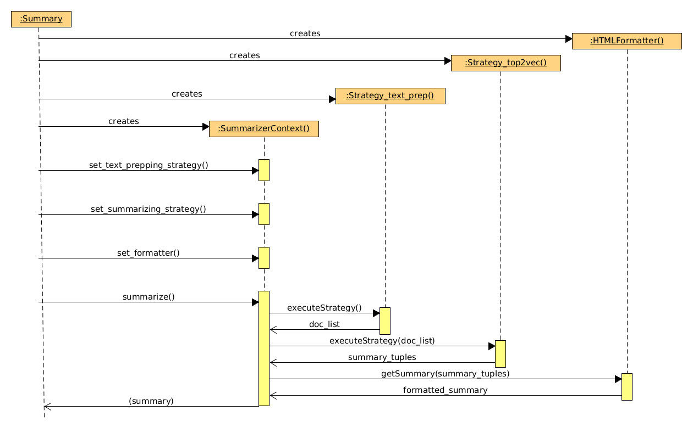
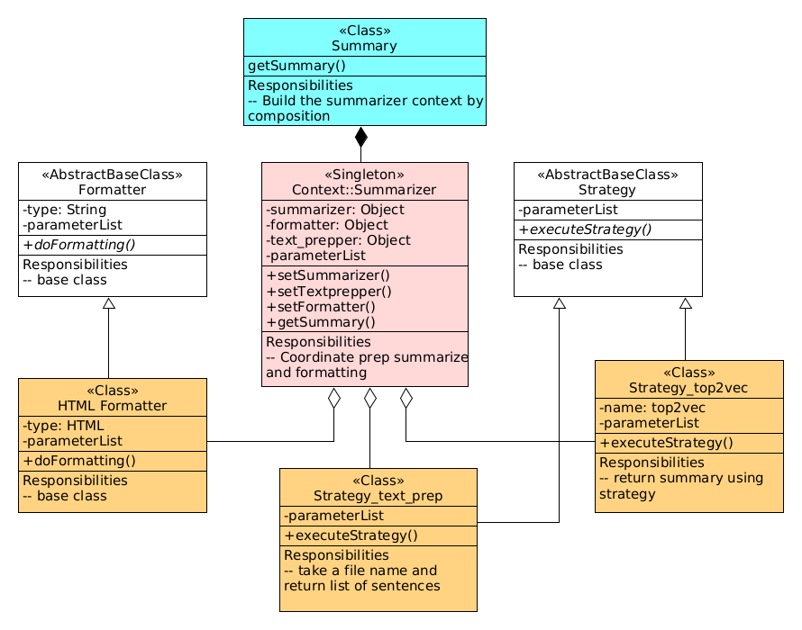

# Requirements

## Need

There is a big boom in textual data created in heaps but very difficult to
shorten and summarize.  A method to summarize text with the help of tools
helps in mitigating the problem.

## Problem

We have a big body of text and we want to understand the text.  Reading through
the whole text and manually summarizing would be complicated and time consuming.
However, without much usage of software for this task, we are hard pressed to
do it manually.  Researchers and scientists go through a lot of written material
and summarize them mostly in this way and better methods would really help them.

## Use cases

Getting on top of reports
:  One needs to comprehend which reports are the more important ones that
	need to be read in full and followed up.  A text summarizer can be used to
	get summaries of these reports which can then be prioritized for action.

Digesting news stories
:  It is a common necessity to stay on top of the day's news.  A text
   summarizer can be used to summarize the news stories and prepare a
   news digest.

## Solution

Manual summarization can be partially or completely automated.  Text can be
summarized by a method called extractive text summarization.  This saves the
labour of reading through a large amount of written or typed material and
summarizing them.

It works by taking a body of text and dividing them into (sub)topics
after which sentences are allotted to each subtopic using topic modelling algorithm.
Top ranking sentences from each subtopic constitute our summary.

We propose a command line summarizer that takes an article file and prints the
summary to the console.  There would be options to control the summarization.

_A note of caution is this method might not work for all kinds of text but only
for some of them._

# Design

## Outline

Our summarization begins with an article which forms our 'corpus'.  The 'corpus'
is broken down into themes which the program recognizes as 'topics' and in our
understanding as the 'sub-topics'.  The topics are broken down into smaller units or sentences which are our 'documents'.  Our summarizer works on these sub-topics
by allotting sentences to each topic.  The top-ranking sentences or
documents from each topic contribute to our summarized text.  

## Conceptual design

We can envisage the summarization process as three functions:

- text prepping
- generating the summary
- formatting the summary for presentation

Each of these can be conceptualized as an object.  For design flexibility and
extendability, we can also think of packaging these three steps into a
summarizing context.

We try to enhance flexibility by using abstract base classes, using design
patterns and exploiting aggregation or composition as appropriate.

## Class design

Functions are organised into classes and objects and the Strategy pattern
is specifically used.  We start with the sequence diagram; the class heirarchy and the different roles they play are outlined next.

{ width=90% }

We have the `SummarizerContext` which is an aggregation of the three function
classes -- the three functions have been enumerated above.  The `SummarizerContext` is
built inside the `Summary` object which is itself built by composition using the `SummarizerContext` object.

There are two abstract base classes.  They are the Formatter and the
Strategy classes.  The Formatter class takes care of formatting the output.
The TextPrepper (`Strategy_text_prep`) implements the Strategy to take care of sentencizing the text.  The TextSummarizer (`Strategy_top2vec`) implements the Strategy to identify sub-topics and summarize the text.  These Abstract Base Classes allow for easy extension of functionality via subclasses.

The Formatter base class has a subclass called the HTML Formatter.  This takes
care of converting the output into an HTML format.

All the three subclasses are aggregated by a Singleton `SummarizerContext` class.  The Singleton class bears the responsibility of coordinating the behaviour of these subclasses.

## Interfaces and Data structures

The TextPrepper class accepts an article as a file and returns a list of documents.
The documents are sentences in our case.

The TextSummarizer class accepts the list of documents and generates a list of
document IDs and their corresponding scores grouped by topic.  The document
text is also optionally available.

The formatter class takes the TextSummarizer as the input and returns the
formatted output either in the plain format or in the HTML format.

## Extensions and modifications

The class heirarchy makes it possible to modify the behaviour of the summarizer
quite easily.

- The summarizing algorithm can be changed by inheriting from the strategy class
and implementing the modified algorithm.  The current algorithm is *top2vec*.
- Different formatting styles can be supported by writing the appropriate classes
for them.
- The current text prepping style is to split the article into sentences.
Changes are possible here as well -- example: for very large articles, the basic semantic unit can be a paragraph instead of a sentence.

## Avoiding code smells

One of the challenges is to be able to access command line options or web
widget options from deep within the object heirarchy.  This challenge has been
addressed by making the arguments object a class variable of the top level
`Summarizer` class.  This class variable is initialized at the time of creation
of the `Summarizer` class.

In the interest of interface segregation, the text prepper class has a
separate interface to tackle a mass of text while in the webapp mode.
In the CLI mode, the default interface handles file input.

## Web interface

We have used Gradio to provide a web interface to this application.

# References {-}

- <https://top2vec.readthedocs.io/en/stable/Top2Vec.html>
- <https://github.com/ddangelov/Top2Vec>
- <https://www.gradio.app>
