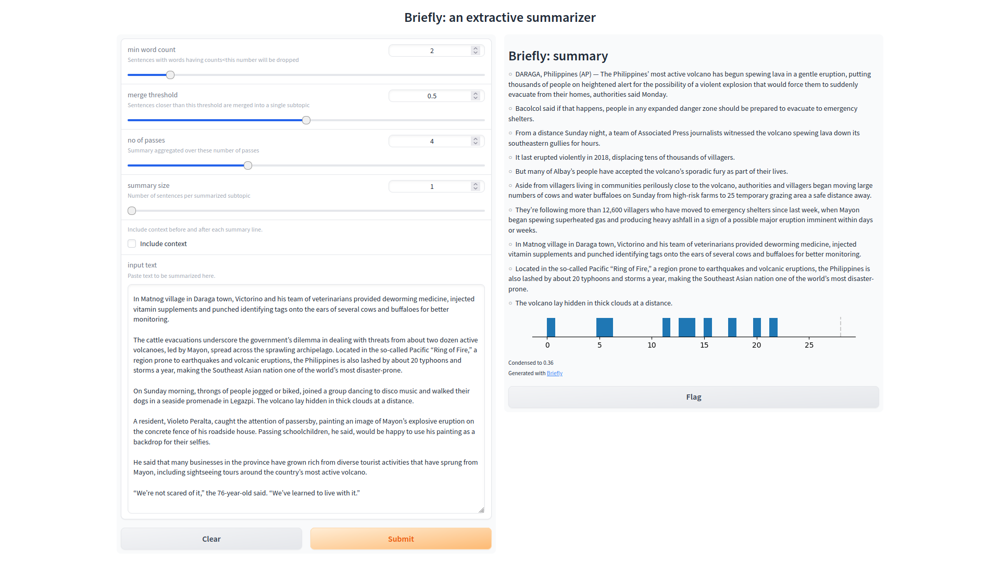

# Briefly

**Briefly** is an experimental extractive text summarizer exploiting
the principles of topic modelling.

It has a command line interface, a convenient web interface and a REST
interface.

Being an extractive summarizer, it captures the semantically important sentences
as determined by the modelling algorithm.  There can be discontinuities in the
flow of the summary with some contextually important sentences being dropped.

# Brief user guide

## CLI

Invoking **Briefly** with the optional file argument produces an HTML-formatted
summary of the input file on the standard output which can be redirected to a file.

```
$ python3 briefly.py -h
usage: briefly.py [-h] [-f FILENAME] [-m min word count] [-t merge threshold] [-s summary size]
                  [-p no. of passes] [-i] [-v]

A program to summarize a text file.

optional arguments:
  -h, --help            show this help message and exit
  -f FILENAME, --filename FILENAME
                        Optional input file to summarize; leave out for web interface.
  -m min word count, --min_word_count min word count
                        Sentences with words having counts < this number will be dropped.[2]
  -t merge threshold, --merge_threshold merge threshold
                        Sentences closer than this threshold are merged into a single
                        subtopic.[0.01]
  -s summary size, --summary_size summary size
                        Number of sentences per summarized subtopic.[1]
  -p no. of passes, --passes no. of passes
                        Summary aggregated over these number of passes.[4]
  -i, --include_context
                        Include context before and after each summary line.[False]
  -v, --verbose         Enable verbose mode.[False]
```

## Web app


Invoking **Briefly** without the optional file argument brings up the web interface
on `http://localhost:7860`.




## REST API

```fastapi run briefly.py``` runs the summarizer exposing a REST API on the URL
`http://localhost:8000`.


- To update options to the app use the `/options` PUT endpoint.  
- To retrieve options from the app, use the `/options` GET endpoint.  
- To create a summary and retrieve it, use the `/summary` POST endpoint while
providing the text to be summarized as a JSON object.  

All arguments are set to default values to get a reasonable summary.  However,
you can experiment with the arguments within some limits.

- For small articles, setting `min_word_count` to a large value will only
capture stopwords.  You can experiment with values between 2 and 10.
Higher values of `-m` tend to give tighter summaries upto a point.  However,
documents 'too small' to be summarized will cause an error and not produce a
summary.  
- The `merge_threshold` should be as large as possible for highly cohesive
articles to get a tight summary.  
- The `summary_size` set to large values will get you non-relevant sentences
as part of your summary.  Experiment with lower values for tighter summaries.  
- Higher values of `passes` tends to give more stable/repeatable and larger
summaries across multiple invocations.  
- Use the `-i` or `--include_context` option to include context before and
after a summary line.  This helps add 'continuity' to the summary.  Note that
the context may not necessarily be part of the summary.  

# Installation requirements

Inside your virtual environment, use the `requirements.txt` file
to download and install the dependencies.

> `pip -r requirements.txt`

- [top2vec](https://top2vec.readthedocs.io/en/stable/Top2Vec.html#installation)

